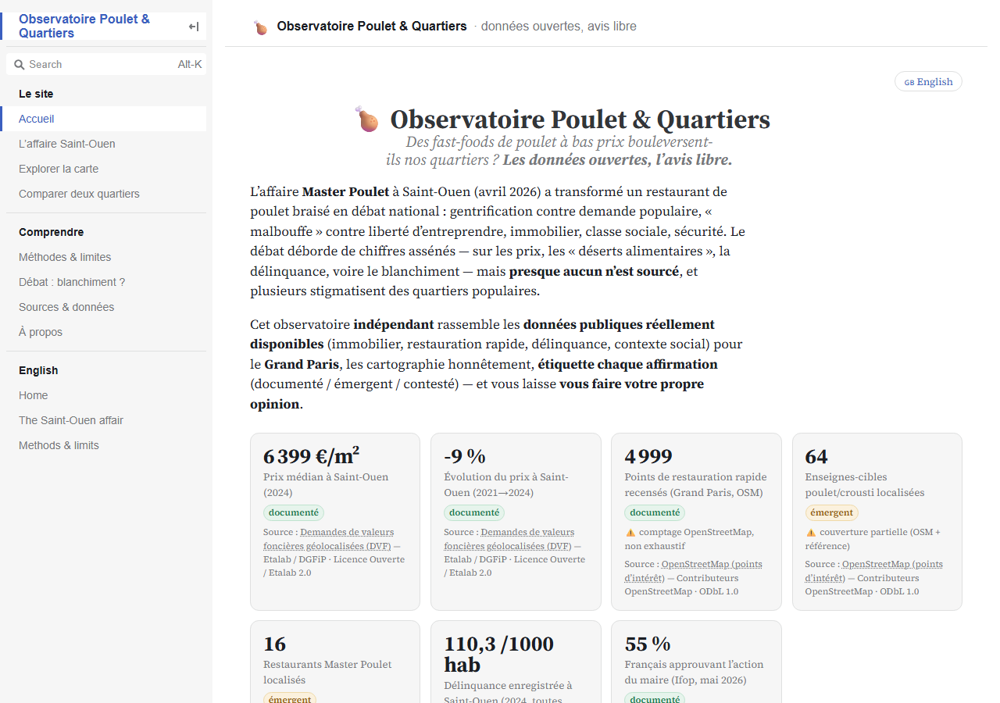
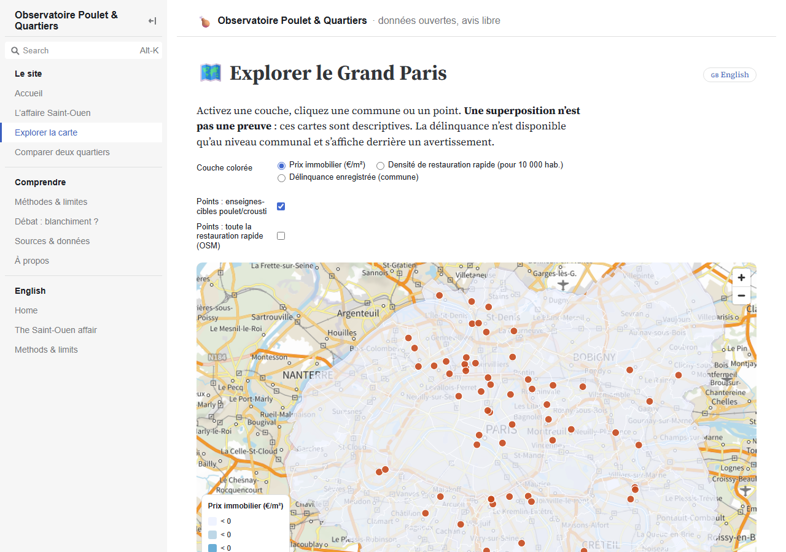
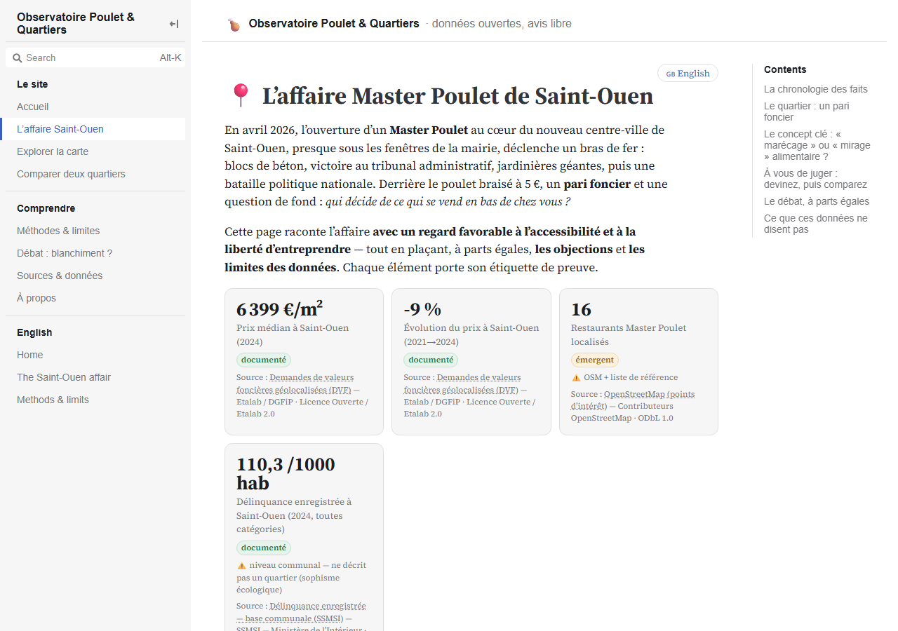

<div align="center">

# 🍗 Observatoire Poulet & Quartiers

### Des fast-foods de poulet à bas prix bouleversent-ils nos quartiers ?
**Les données ouvertes, l'avis libre.** · *Open data, your own opinion.*

[](LICENSE)
[](https://www.etalab.gouv.fr/licence-ouverte-open-licence/)
[](https://observablehq.com/framework/)
[](https://maplibre.org/)
[](#-whats-real-in-this-mvp)

An **independent, bilingual (🇫🇷/🇬🇧) open-data observatory** that maps the real neighborhood footprint of low-cost halal fried-chicken chains in France — and lets every citizen reach their own conclusion.



</div>

---

## 🥖 Why this exists

In **April 2026**, a **Master Poulet** chicken shop opened in the heart of Saint-Ouen, almost under the town hall's windows. Three days later the mayor closed it and set **concrete blocks** at the door; a court ruled the blocking an *illegal violation of the freedom of enterprise*; the city replied with **giant flowerpots**. The "**guerre du poulet**" went national — gentrification vs. popular demand, "junk food" vs. accessibility, class, halal, real estate, safety.

The debate overflowed with confident figures — on prices, "food deserts", crime, even money laundering — yet **almost none were sourced**, and several openly **stigmatized** working-class neighborhoods.

This project turns that noise into something useful: a **transparent, reproducible, source-cited** tool built **only on open public data**, where every claim is labelled **documented / emerging / contested** — so you can make up your own mind instead of picking a side handed to you.

> 🧭 The rule of the house: **never present a correlation as a cause, nor a rumor as a fact.**

---

## 🔎 What you can do

<table>
<tr>
<td width="50%" valign="top">

### 🗺️ Explore the map
Toggle layers across Greater Paris — **property prices** (€/m²), **fast-food density**, **target chicken chains**, and **municipal crime** (shown only behind an *ecological-fallacy* warning). Click any commune or outlet.

</td>
<td width="50%" valign="top">

### 📍 The Saint-Ouen affair
A two-sided case study: the timeline, the **price trend**, a focused map, a *"draw your guess then compare"* moment, and a **pour / objections** debate panel — each argument tagged with its evidence level.

</td>
</tr>
</table>

<div align="center">


</div>

### 🏘️ My neighborhood *(new)*
Type **any French address** → the **life & death of the fast-food shops around you**: how many, which brands, which **closed or went bankrupt**, and **how long they last** (a survival curve vs. your commune & France), with a downloadable **share card**. National **SIRENE** survival data + **live BODACC** bankruptcy lookups. Honest by design: closures are normal small-business churn, independents are never named, and revenue is shown only where public.

Plus a **two-commune comparison**, a transparent **Methods & limits** page, a **"money-laundering: proven vs. rumour"** explainer, a **sources** registry, and a full **English mirror**.

---

## 📊 What's real in this MVP

Scope: **Greater Paris** — Paris (75) · Hauts-de-Seine (92) · Seine-Saint-Denis (93) · Val-de-Marne (94).

| Layer | Source | Status |
|---|---|---|
| 🏠 Property prices (median €/m², 2021–2024) | **DVF** géolocalisé (Etalab/DGFiP) | ✅ real — 337k sales |
| 🍔 Fast-food density | **OpenStreetMap** `amenity=fast_food` | ✅ real — 4 999 POIs *(non-exhaustive)* |
| 🍗 Target chicken/crousti outlets | OSM brand match + reference seed | ✅ real — 64 outlets |
| 🚨 Recorded crime (commune, 2016–2025) | **SSMSI** (Ministère de l'Intérieur) | ✅ real *(municipal only, gated)* |
| 🏘️ Fast-food **survival, closures & lifespan** (national) | **SIRENE** (INSEE) | ✅ real — **393k shops, 233k already closed** |
| ⚖️ **Bankruptcies** (live, on-demand) | **BODACC** (DILA) | ✅ real — queried by SIREN in the browser |
| 🗺️ Boundaries & basemap | **IGN** Géoplateforme | ✅ real |
| 💶 Income / poverty (Filosofi) · SIRENE 56.10C | INSEE | ⏳ national version |

> ✔️ A sanity check is baked into the pipeline: Saint-Ouen's median lands at **6 399 €/m²** (2024), matching the press dossier's *">6 300 €/m²"*.

---

## 🛡️ Built for trust (the part that matters)

This is what separates an observatory from a hot take:

- **Evidence labels on every number** — `documenté` / `émergent` / `contesté`, with a source link on every figure.
- **Reverse causation, up front** — cheap food locates where rents are *already* low; the cause usually precedes the shop.
- **Crime stays commune-level, behind a gate** — context, never a cause attributable to a shop or a population.
- **Statistical-secrecy values stay `null`, never `0`** — a suppressed cell reads "non diffusé".
- **No money-laundering map, no identity framing** — the cash-business risk is real in general but **unproven** for these brands, and we say exactly that.
- **RGPD-safe** — only non-nominative parcel/establishment data, **no cookies, no trackers**.

---

## ⚙️ How it works

```
Public open data ──▶ Node + DuckDB pipeline ──▶ src/data/*.json ──▶ Observable Framework
 (DVF, OSM, SSMSI,      (download, clean,         (flat GeoJSON/JSON     (static site: MapLibre
  IGN, geo.api)          spatial-join, publish)    the site consumes)     maps + Plot charts)
```

No server, no database at runtime, no tracker — a fully **static, cheap-to-host** site.

**Pipeline stages** (`pipeline/`): `30_geo` (boundaries) · `10_dvf` (prices) · `20_chains` (fast-food + brands) · `32_crime` (SSMSI) · `40_summary` (KPIs). Each is reproducible from public URLs.

---

## 🚀 Quickstart

```bash
npm install
npm run pipeline     # rebuild src/data/ from public sources (Node + DuckDB)
npm run dev          # Observable Framework preview → http://localhost:3000
npm run build        # static build → dist/
node test/smoke.mjs  # headless smoke test (uses system Chrome) → "11/11 pages clean"
```

Deploy `dist/` to any static host (Cloudflare Pages / Netlify / GitHub Pages). See [`CLAUDE.md`](CLAUDE.md) for architecture and data-source gotchas, [`src/methodes.md`](src/methodes.md) for methodology, and [`DESIGN_BRIEF.md`](DESIGN_BRIEF.md) for the redesign roadmap.

---

## 🗺️ Roadmap

- **v1 — national** · INSEE Filosofi income/poverty (IRIS), SIRENE 56.10C legal universe, France-wide scale-up (PMTiles).
- **v2 — inferential** · event-study (difference-in-differences) around a chain opening, **with confidence intervals** and reverse-causation warnings — never on the home page.
- **Design & growth** · scrollytelling, mobile-first map, social share-cards, "your neighborhood" deep links (see `DESIGN_BRIEF.md`).

---

## 📜 License & attribution

**Code:** MIT. **Data:** Licence Ouverte / Etalab 2.0 (OpenStreetMap: ODbL).

Contains data from **Etalab/DGFiP** (DVF), **INSEE** (SIRENE, census), **SSMSI — Ministère de l'Intérieur** (crime), **IGN** (boundaries, basemap), and **© OpenStreetMap contributors**.

> ⚖️ **Independent observatory — affiliated with no chain and with no politician.** The pro-chain support dossier is cited only as *one party's position*, never as the site's voice. Figures are dated by their source vintage; corrections welcome.

<div align="center"><sub>Made with open data, DuckDB, MapLibre & Observable Framework.</sub></div>
