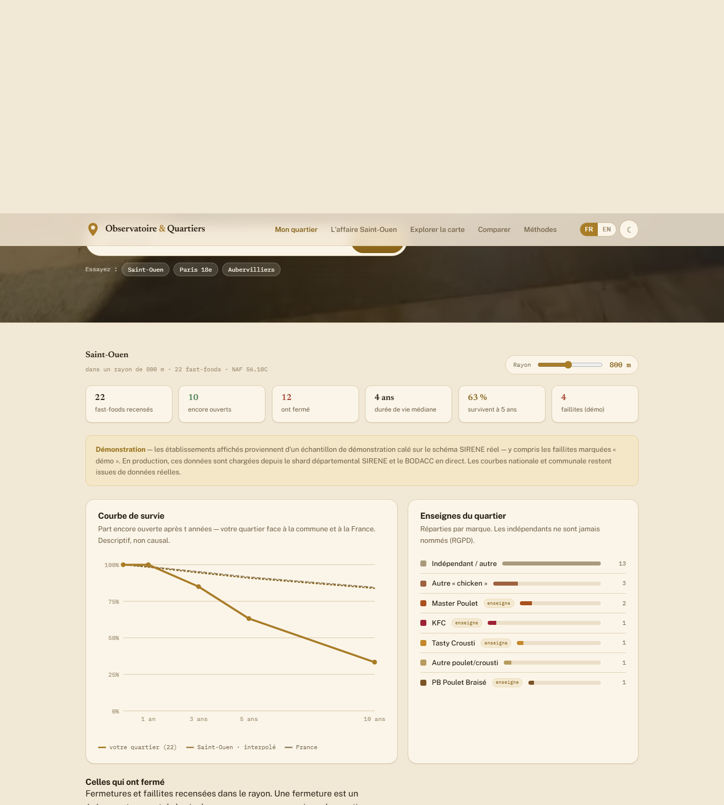

# Observatoire Poulet & Quartiers — Refonte « marbre & or » (proof of concept)

> **Branche `design-handoff`** — maquettes haute-fidélité en HTML/CSS/JS vanilla de la refonte visuelle de l'observatoire, et de la nouvelle fonction **« Mon quartier »**. C'est un **proof of concept** d'un produit d'analyse de quartier : à terme, des analyses de ce type seront proposées aux résidents par abonnement. Le site de production (Observable Framework) vit sur la branche [`main`](https://github.com/ShellPayant/observatoire-poulet-quartiers/tree/main).


## Voir la démo

Aucun build, aucune dépendance. Ouvrez `index.html` dans un navigateur, ou servez le dossier :

```bash
npx serve .
```

| Page | Contenu |
|---|---|
| `index.html` | Accueil — hero monumental, bandeau KPI sourcé, règle de la maison, 4 modes |
| `mon-quartier.html` | **La nouvelle fonction** — tapez une adresse : recensement des fast-foods voisins, courbe de survie, fermetures & faillites, carte partageable PNG |
| `explorer.html` | Carte du Grand Paris — couches prix / densité / délinquance (portail de consentement) |
| `affaire-saint-ouen.html` | Scrollytelling — l'affaire Saint-Ouen, « dessinez votre estimation » |
| `systeme.html` | Design system & méthodes — tokens, badges de preuve, registre des sources |

Bilingue **FR/EN**, thème **clair/sombre**, aucun cookie, aucun pisteur. Direction artistique « marbre & or antique » : donner à un sujet populaire la gravité d'une institution, sans condescendance.



## Honnêteté des données de démonstration

Le produit promet « chaque chiffre sourcé ». Cette maquette utilise donc un étiquetage explicite partout où la démo ne peut pas l'être :

- **Mon quartier** : les établissements proviennent d'un **échantillon synthétique** (SIREN fictifs, schéma de shard SIRENE réel) — bandeau « Démonstration » affiché en permanence ; les faillites simulées sont marquées **« démo »**, jamais « BODACC » ; la courbe communale est marquée **« interpolé »** (seul le point à 5 ans est réel).
- **Explorer** : valeurs illustratives signalées dans le rail (réelles pour Saint-Ouen et les repères) ; fond de carte schématique assumé.
- Les agrégats nationaux et communaux (`src/data/fastfood_survival.json`) sont, eux, calculés depuis les données réelles SIRENE.
- En production : shards départementaux SIRENE réels, BODACC interrogé en direct, tuiles DVF/SSMSI réelles.

Les garde-fous du produit sont déjà dans la maquette : indépendants **jamais nommés** (RGPD), délinquance en **ardoise jamais rouge** + portail de consentement + rappel du sophisme écologique, `null` ≠ `0` (secret statistique), preuve = couleur **et** glyphe, `prefers-reduced-motion` respecté.

## Portage vers la production

Le guide de portage complet (cibles Observable Framework, tokens, schéma de données, interactions) : **[`docs/DESIGN_HANDOFF.md`](docs/DESIGN_HANDOFF.md)**. À porter en premier : `assets/tokens.css`.

## Données & attributions

| Source | Producteur | Licence |
|---|---|---|
| SIRENE | INSEE | Licence Ouverte / Etalab 2.0 |
| BODACC (annonces commerciales) | DILA | Licence Ouverte / Etalab 2.0 |
| DVF (valeurs foncières) | Etalab / DGFiP | Licence Ouverte / Etalab 2.0 |
| Géocodage | IGN Géoplateforme (`data.geopf.fr`) | Licence Ouverte / Etalab 2.0 |
| Points restauration rapide | © contributeurs OpenStreetMap | ODbL 1.0 |
| Délinquance communale | SSMSI — Ministère de l'Intérieur | Licence Ouverte / Etalab 2.0 |
| Polices (Newsreader, Public Sans, IBM Plex Mono) | Google Fonts | SIL OFL |

La photographie du portique (`assets/img/portico.png`, dont dérivent toutes les images classiques) est une **photo personnelle de l'auteur**.

## Licence

**Le code et les maquettes de cette branche `design-handoff` sont © 2026 — tous droits réservés.** Ils constituent un proof of concept produit et **ne sont pas couverts** par la licence MIT de la branche `main`. Les données ouvertes citées ci-dessus restent réutilisables selon leurs licences respectives.
